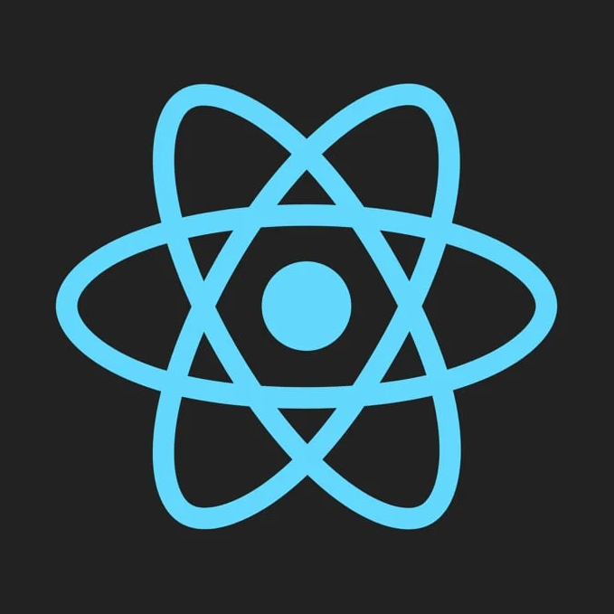
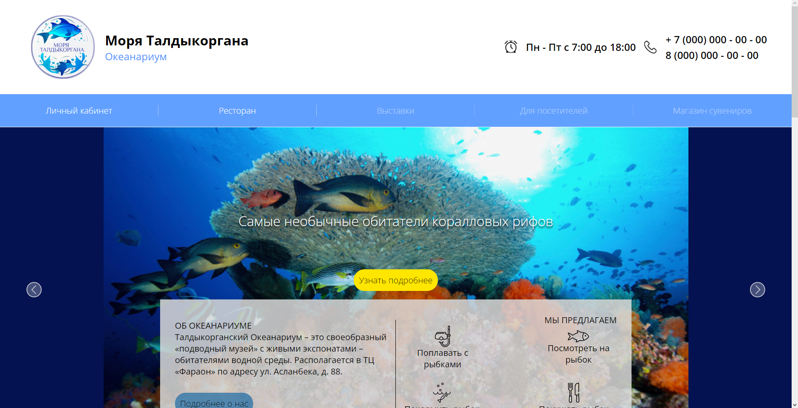
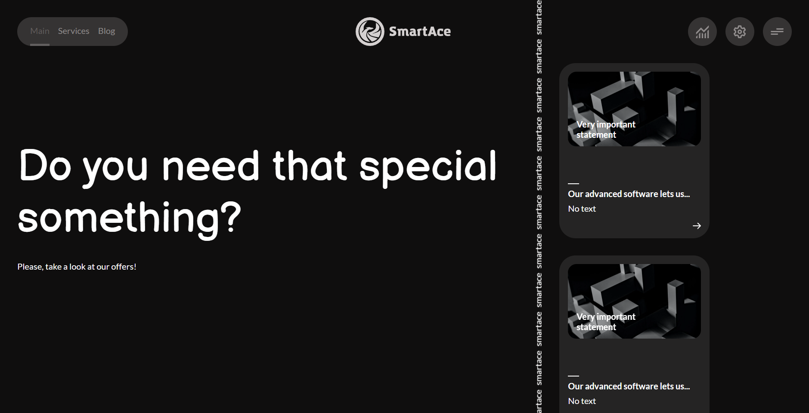

# XenoPOMP

My name\`s Alex, I\`m junior front-end developer. I specialize in ReactJS.

## My skills
- React
- TypeScript
- Redux Toolkit

## My projects
### ``react-vite-template``

Small project based on Vite, using RTK, Vitest and other.

Links:

1. Repo: [link](https://github.com/XenoPOMP/react-vite-template)

### ``Taldyk Oceanarium site``

This one is my college`s project. The task was to create a website for oceanarium, also site should be translated to russian and kazakh languages.

For this project, I also created a backend on Nest.

Links:

1. Repo (frontend): [link](https://github.com/XenoPOMP/college-2023-oceanarium)
2. Repo (backend): [link](https://github.com/XenoPOMP/college-2023-oceanarium-server)
3. Site on hosting: [link](https://taldykoceanarium.netlify.app)

### ``Course work in 2023``

This one is my college`s project too. My theme was to create website for IT-service company.

I realized UI themes, russian and english localization, privacy settings.

For this project I created backend with Nest and using WebSockets.

1. Repo (frontend): [link](https://github.com/XenoPOMP/coursework-2023)
2. Repo (backend): [link](https://github.com/XenoPOMP/coursework-2023-backend)
3. Site on hosting: [link](https://xeno-coursework-2023.netlify.app)