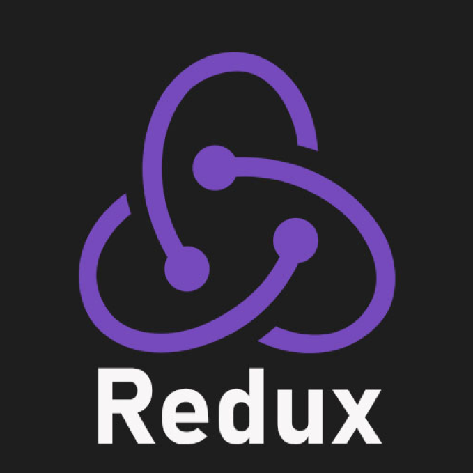

# XenoPOMP

My name\`s Alex, I\`m junior front-end developer. I specialize in ReactJS.

## My skills
- React
- TypeScript
- Redux Toolkit

## My projects

| Name | Description | Photos |  
| ---- | ----------- | ------ |
| [react-vite-template](https://github.com/XenoPOMP/react-vite-template) | Small project based on Vite, using RTK, Vitest and other. |    |
| [Taldyk Oceanarium site](https://github.com/XenoPOMP/college-2023-oceanarium) | This one is my college`s project. The task was to create a website for oceanarium, also site should be translated to russian and kazakh languages. For this project, I also created a backend on Nest. |  |
| [Course work in 2023](https://github.com/XenoPOMP/coursework-2023) | This one is my college`s project too. My theme was to create website for IT-service company. I realized UI themes, russian and english localization, privacy settings. For this project I created backend with Nest and using WebSockets. |  |
